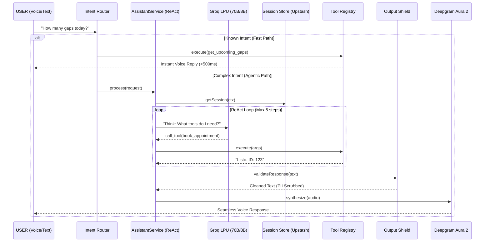

# 🧠 Luis IA: Master Architecture & Orchestration Guide

> **"The Brain of the Business: A Hardened, Agentic Executive Assistant."**

Luis IA is a production-grade AI orchestrator designed for service businesses. It manages real-time voice and text interactions, executing complex business logic across a multi-tenant architecture with high reliability and strict security standards.

---

## 1. System Philosophy (Vibe + Solidez)

Luis is built on the principle of **Agentic Resilience**. Unlike simple chatbots, Luis utilizes a **ReAct (Reason + Act)** loop to navigate ambiguity. It prioritizes:
1.  **Low Latency**: Intent-based routing to skip slow LLM calls.
2.  **Safety**: Multi-layer shields to prevent data leaks and prompt injections.
3.  **Persistence**: Global session storage via Redis for serverless consistency.
4.  **Auditability**: Granular logging of every tool execution and reasoning step.

---

## 2. High-Level Orchestration Pipeline

The current architecture (V8.0) utilizes a decoupled, asynchronous pipeline to ensure responsiveness even during heavy AI inference.

---

## 3. Core Architectural Components

### A. The ReAct Orchestrator (`AssistantService.ts`)
The heart of Luis IA. It manages the conversation state and the reasoning loop.
- **Max Steps**: 5 (prevents infinite reasoning loops).
- **Tool Awareness**: Dynamically injects available tools based on the current user's role and business context.
- **Success Prefix**: Enforces a `"Listo."` protocol for tools to signal successful state changes.

### B. Intent Router (`intent-router.ts`)
A zero-inference layer that uses high-performance regex and keyword matching.
- **Efficiency**: Saves ~2000 tokens per administrative query.
- **Latency**: Reduces TTF (Time to First-word) by ~80% for common status checks.

### C. Output Shield & PII Protection (`output-shield.ts`)
A defensive perimeter that scans LLM outputs before they leave the server.
- **PII Scrubbing**: Automatically masks Phone Numbers, UUIDs, and Email addresses.
- **System Hardening**: Blocks responses containing internal tool names (e.g., `book_appointment`) or database schema hints.
- **Anti-Injection**: Detects and blocks LLM-generated attempts to "pretend" to be a system administrator.

### D. Global Session Store (`session-store.ts`)
Utilizes **Upstash Redis** to maintain "Conversation Memory" in stateless serverless environments (Vercel).
- **Atomicity**: Prevents race conditions when a user sends multiple voice notes in rapid succession.
- **TTL**: Sessions are automatically purged after 30 minutes of inactivity to respect privacy.

---

## 4. Multi-Tenant Tool Registry

Luis is empowered with 16+ specialized tools, all isolated at the database level via **PostgreSQL Row Level Security (RLS)**.

| Category | Tools | Security Constraint |
|:---:|:---|:---|
| **Write** | `book_appointment`, `cancel_appointment`, `create_client` | Rate-limited (20 ops/hour), Audit Logged |
| **Read** | `get_today_summary`, `get_upcoming_gaps`, `get_revenue_stats` | Business-scoped only |
| **Integrations**| `send_whatsapp_message` | Webhook-authorized |

---

## 5. Model Tiering Strategy

To optimize for the **Groq Free Tier** (100k TPD), Luis uses a dual-model strategy:

1.  **Quality Tier (Llama-3.3-70B)**: Used for all **WRITE** operations. High precision is required to avoid scheduling conflicts or data corruption.
2.  **Fast Tier (Llama-3.1-8B)**: Used for **READ** operations and conversational chit-chat. Near-instant response times.

---

## 6. How to Extend (Developer Operations)

### Adding a New Tool
1.  **Implement**: Add the logic in `lib/ai/assistant-tools.ts`.
2.  **Declare**: Add the JSON Schema in `lib/ai/tool-registry.ts`.
3.  **Audit**: Ensure the tool returns a string starting with `"Listo."` for the ReAct loop to recognize success.

### Debugging the Loop
Luis logs his internal monologue to the console and **Sentry** with specialized breadcrumbs:
- `THOUGHT`: The LLM's reasoning.
- `ACTION`: The tool being called.
- `OBSERVATION`: The raw data returned by the database.

---

## 7. Security Standards (The "Shield" Layer)
- **Rate Limiting**: 10 requests/min (General) | 20 actions/hour (Critical Writes).
- **JWT Mapping**: Business ID is NEVER accepted from the client; it is retrieved from the verified Supabase Auth session on the server.
- **Data Scrubbing**: Sentry integration excludes `Authorization` headers and `PII` from error logs.

---
*Last Updated: April 2026 | Version: 8.0 (Hardened)*
