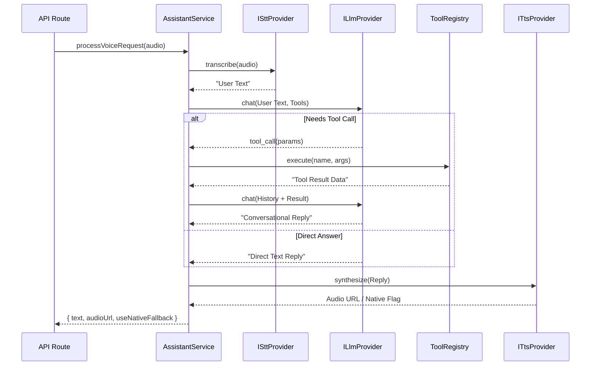

# 🧠 Cronix: AI Orchestration Architecture

This document details the "Cerebro" (Brain) of the Luis IA assistant, specifically its orchestration logic and provider-agnostic implementation.

## 💎 The Platinum Orchestrator: `AssistantService`

The `AssistantService` is the domain-level heart of the voice interaction. It manages the complex dance between different AI modalities without being tied to specific vendors.

### The Voice Pipeline (The Golden Path)

## 🏗️ Layered Independence

### 1. The Provider Layer (Infrastructure)
We use the **Dependency Inversion Principle**. The service depends on interfaces (`ISttProvider`, etc.), not on concrete classes like `GroqProvider`. 
> [!TIP]
> To add a new provider (e.g., OpenAI), implement the interface and inject it into the service in the API route.

### 2. The Multi-Pass LLM Bridge
Luis IA performs a **two-pass reasoning** logic:
- **Pass 1**: Context Analysis. The LLM decides if it needs to query the database or perform an action.
- **Pass 2**: Synthesis. After getting the data from the tools, it builds a natural, executive response for the user.

## 🚀 Scalability
By using the `ToolRegistry`, adding a new "Power" to Luis IA is as simple as:
1. Creating a tool function in `assistant-tools.ts`.
2. Registering it in `tool-registry.ts`.
Luis will automatically understand the new capability in the next request.
