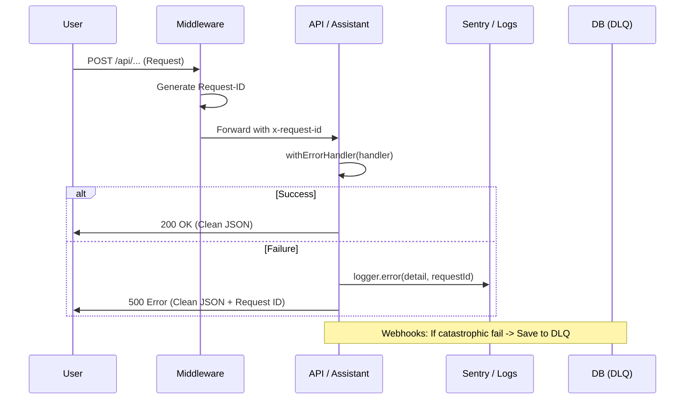

This document outlines the **Platinum Architecture** implemented to transform Cronix into a bulletproof SaaS platform. We move from "Error Handling" to **Reliability Engineering** and **Provider Agnosticism**.

## 🏛️ Platinum Architecture (DDD)
The system is divided into three independent layers to ensure total separation of concerns:
1. **Infrastructure (Providers)**: Vendor-agnostic implementations of STT, LLM, and TTS.
2. **Domain (Orchestration)**: The `AssistantService` manages business logic and tool execution without knowing about the transport layer (API).
3. **Transport (API)**: Clean routes that only handle authentication, rate-limiting, and service invocation.

## 🛡️ The 4-Layer Shield

### 1. Visibility Layer (Observability)
- **Centralized Logger**: Every log entry flows through `lib/logger.ts`.
- **Sentry Integration**: In production, all `logger.error` calls trigger `Sentry.captureException` automatically.
- **Traceability**: Every request is tagged with a unique `x-request-id` via `middleware.ts`. This ID propagates across the stack, allowing us to correlate a frontend error with a specific database log.

### 2. Global API Resilience (HOF)
- **`withErrorHandler`**: A Higher Order Function that wraps all API Route Handlers.
- **Safety**: Captures uncaught async errors, logs them with context (Request ID, path, stack), and returns a non-leaking JSON response to the client.
- **Consistency**: Standardizes the error schema across all endpoints.

### 3. AI Resilience Orchestrator
Specialized layer for non-deterministic services (Groq, ElevenLabs):
- **Groq Fallback**: If the primary model (Llama-3.3-70b) hits rate limits or fails, the system automatically swerves to a fallback model (Llama-3-8b).
- **ElevenLabs Fallback**: If voice synthesis fails, the API flags `useNativeFallback: true`, allowing the frontend to use the browser's native TTS instantly.
- **Retries**: Automatic exponential backoff for transient 5xx errors.

### 4. Dead Letter Queue (DLQ)
- **Zero Data Loss**: Implementation of `wa_dead_letter_queue` table.
- **Resilience**: Every incoming WhatsApp webhook is wrapped in a DLQ safeguard. If processing fails, the raw payload and error are saved for manual autopsy and retry.
- **Privatization**: Raw payloads are protected by Service Role RLS.

### 5. Circuit Breaker (Self-Protection Logic)
-   **AICircuitBreaker**: Monitors real-time failures for STT, LLM, and TTS.
-   **Tripping**: If a service fails 5 consecutive times, the circuit "opens" for 5 minutes.
-   **Fail-Fast**: During this time, the system avoids calling the failed API, eliminating unnecessary latency and activating fallbacks immediately.

### 6. Rate Limiting (Resource Protection)
-   **Memory Sliding Window**: Implemented in `/api/assistant/voice`.
-   **Rate Limiting**: The system protects against abuse through memory-based sliding windows (10 req/min per user).

### 7. Performance Shield (Indexing & RPC)
- **Compound Indexing**: Implementation of indexes on time columns (`start_at`, `paid_at`) to speed up BI and financial summaries.
- **RPC Encapsulation**: Heavy operations (e.g., filtering inactive clients) are executed natively in Postgres via RPC to minimize memory usage in Deno.

### 8. Contextual Telemetry
- All errors in the AI tools (`assistant-tools.ts`) are logged with the tenant's `business_id`, facilitating real-time technical support for scheduling issues.

### 9. AI Security Firewall (Hardening)
- **Prompt Injection Defense**: Strict directives in the `SYSTEM_PROMPT` to prevent the revelation of internal instructions.
- **Input Sanitization**: Tools validate date ranges and amounts to prevent negative charges or invalid appointments.
- **Error Sanitization**: Technical failures are hidden from the end-user in the `AssistantService` layer, providing a polite and secure response.

### 10. Development Quality Gate (Husky & CI/CD)
To ensure the **Platinum Architecture** remains solid during development, we have implemented a local "Code Customs" system:
- **Pre-commit Hook (Husky)**: Before each commit, the system automatically runs `npm run lint` and `npm run typecheck`.
- **Fail-Fast**: If there is a type or style error, the commit is blocked. This prevents "broken" code from reaching Vercel or GitHub, eliminating failed deployment cycles.
- **Full Verification**: Unlike partial reviews, the total integrity of the project is validated to ensure that changes in one module do not break distant dependencies.

---

## 📡 Traceability Flow

## 🛠️ Maintenance & Monitoring
- **Sentry Dashboard**: Monitor the `AI-STT`, `AI-LLM`, and `API-CRASH` tags.
- **DLQ Autopsy**: Query `public.wa_dead_letter_queue` to identify patterns in failed payloads from Meta.
