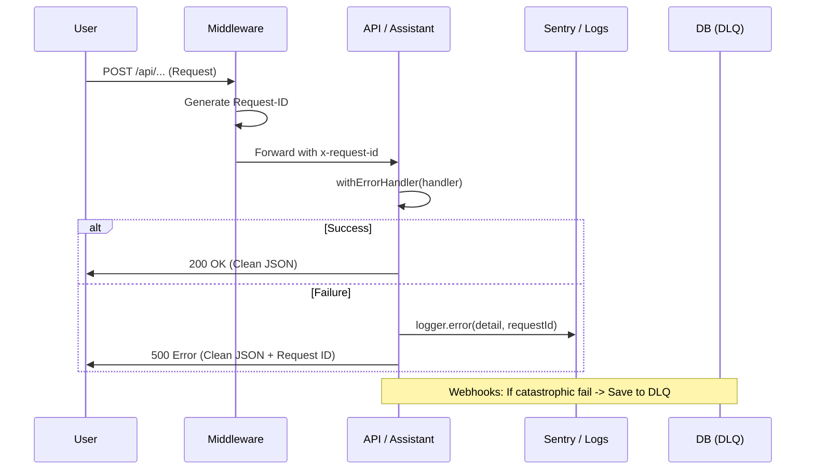

This document outlines the **Platinum Architecture** implemented to transform Cronix into a bulletproof SaaS platform. We move from "Error Handling" to **Reliability Engineering** and **Provider Agnosticism**.

## 🏛️ Platinum Architecture (DDD)
The system is divided into three independent layers to ensure total separation of concerns:
1. **Infrastructure (Providers)**: Vendor-agnostic implementations of STT, LLM, and TTS.
2. **Domain (Orchestration)**: The `AssistantService` manages business logic and tool execution without knowing about the transport layer (API).
3. **Transport (API)**: Clean routes that only handle authentication, rate-limiting, and service invocation.

## 🛡️ The 4-Layer Shield

### 1. Visibility Layer (Observability)
- **Centralized Logger**: Every log entry flows through `lib/logger.ts`.
- **Sentry Integration**: In production, all `logger.error` calls trigger `Sentry.captureException` automatically.
- **Traceability**: Every request is tagged with a unique `x-request-id` via `middleware.ts`. This ID propagates across the stack, allowing us to correlate a frontend error with a specific database log.

### 2. Global API Resilience (HOF)
- **`withErrorHandler`**: A Higher Order Function that wraps all API Route Handlers.
- **Safety**: Captures uncaught async errors, logs them with context (Request ID, path, stack), and returns a non-leaking JSON response to the client.
- **Consistency**: Standardizes the error schema across all endpoints.

### 3. AI Resilience Orchestrator
Specialized layer for non-deterministic services (Groq, ElevenLabs):
- **Groq Fallback**: If the primary model (Llama-3.3-70b) hits rate limits or fails, the system automatically swerves to a fallback model (Llama-3-8b).
- **ElevenLabs Fallback**: If voice synthesis fails, the API flags `useNativeFallback: true`, allowing the frontend to use the browser's native TTS instantly.
- **Retries**: Automatic exponential backoff for transient 5xx errors.

### 4. Dead Letter Queue (DLQ)
- **Zero Data Loss**: Implementation of `wa_dead_letter_queue` table.
- **Resilience**: Every incoming WhatsApp webhook is wrapped in a DLQ safeguard. If processing fails, the raw payload and error are saved for manual autopsy and retry.
- **Privatization**: Raw payloads are protected by Service Role RLS.

### 5. Circuit Breaker (Lógica de Autoprotección)
-   **AICircuitBreaker**: Monitorea fallos en tiempo real para STT, LLM y TTS.
-   **Tripping**: Si un servicio falla 5 veces seguidas, el circuito se "abre" durante 5 minutos.
-   **Fail-Fast**: Durante este tiempo, el sistema no intenta llamar a la API fallida, eliminando latencia innecesaria y activando los fallbacks de inmediato.

### 6. Rate Limiting (Protección de Recursos)
-   **Memory Sliding Window**: Implementado en `/api/assistant/voice`.
-   **Rate Limiting**: El sistema protege contra el abuso mediante ventanas deslizantes de memoria (10 req/min por usuario).

### 7. Performance Shield (Indexing & RPC)
- **Compound Indexing**: Implementación de índices en columnas de tiempo (`start_at`, `paid_at`) para acelerar el BI y los resúmenes financieros.
- **RPC Encapsulation**: Las operaciones pesadas (ej: filtrado de clientes inactivos) se ejecutan nativamente en Postgres vía RPC para minimizar el uso de memoria en Deno.

### 8. Contextual Telemetry
- Todos los errores en las herramientas de IA (`assistant-tools.ts`) se loguean con el `business_id` del tenant, facilitando el soporte técnico en tiempo real ante problemas de agendamiento.

### 9. AI Security Firewall (Hardening)
- **Prompt Injection Defense**: Directivas estrictas en el `SYSTEM_PROMPT` para evitar la revelación de instrucciones internas.
- **Input Sanitization**: Las herramientas validan rangos de fechas y montos para evitar cobros negativos o citas inválidas.
- **Error Sanitization**: Los fallos técnicos se ocultan al usuario final en la capa de `AssistantService`, proporcionando una respuesta amable y segura.

### 10. Development Quality Gate (Husky & CI/CD)
Para garantizar que la **Platinum Architecture** se mantenga sólida durante el desarrollo, hemos implementado un sistema de "Aduana de Código" local:
- **Pre-commit Hook (Husky)**: Antes de cada commit, el sistema ejecuta automáticamente `npm run lint` y `npm run typecheck`.
- **Fail-Fast**: Si existe un error de tipos o de estilo, el commit se bloquea. Esto previene que código "roto" llegue a Vercel o GitHub, eliminando ciclos de despliegue fallidos.
- **Full Verification**: A diferencia de revisiones parciales, se valida la integridad total del proyecto para asegurar que cambios en un módulo no rompan dependencias lejanas.

---

## 📡 Traceability Flow

## 🛠️ Maintenance & Monitoring
- **Sentry Dashboard**: Monitor the `AI-STT`, `AI-LLM`, and `API-CRASH` tags.
- **DLQ Autopsy**: Query `public.wa_dead_letter_queue` to identify patterns in failed payloads from Meta.
